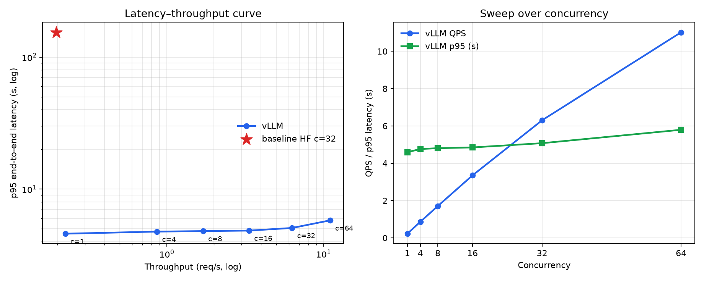
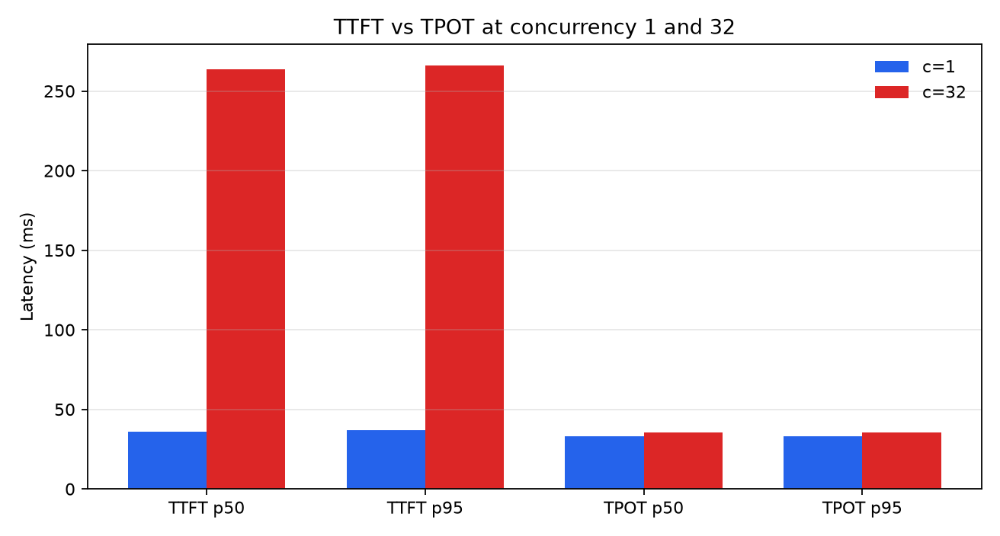
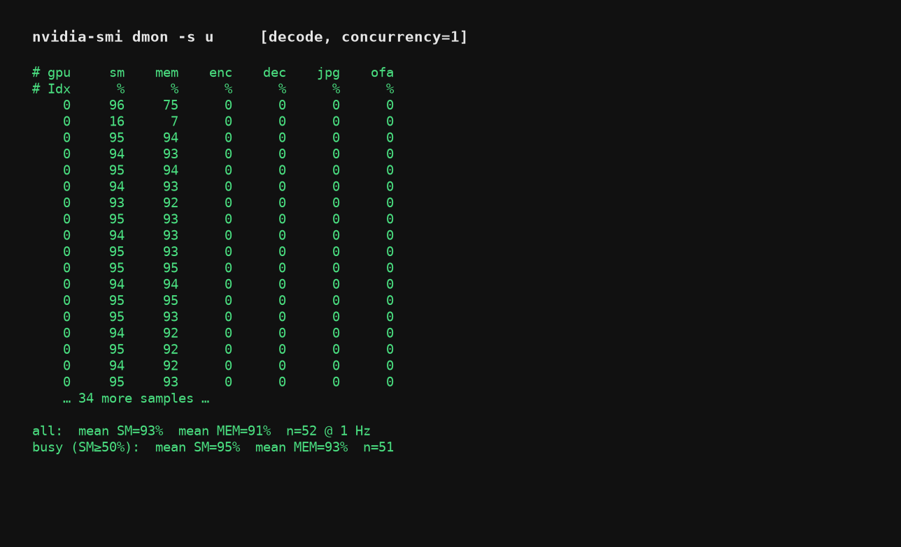
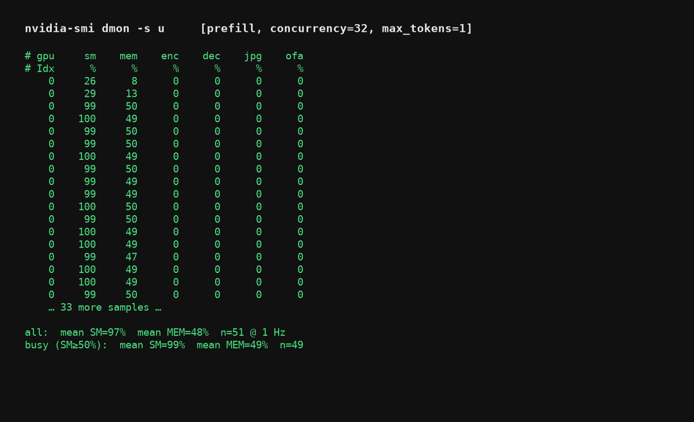
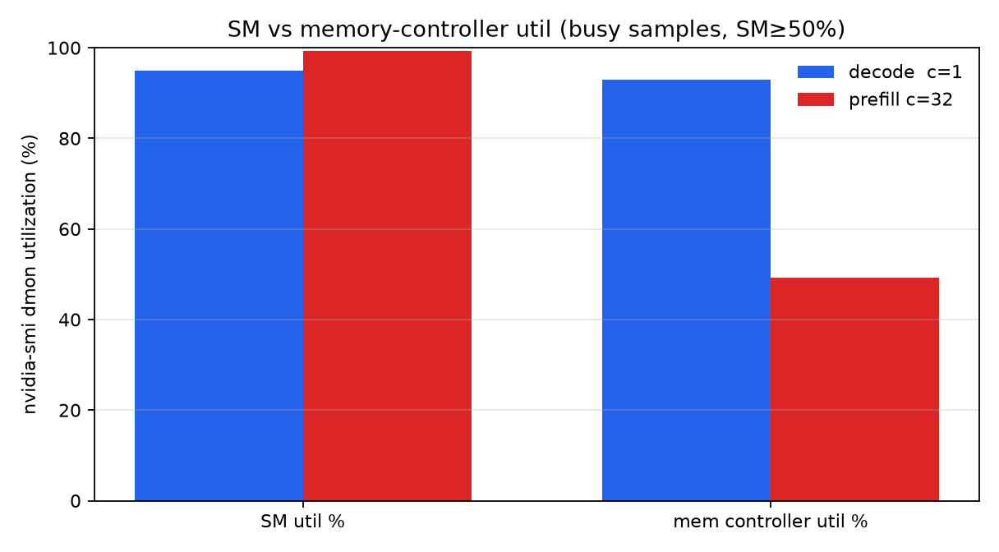

# Lab 01 — Serving Baseline and Bottleneck Characterization

**Status:** Measurements complete on one RTX 4060 Ti 16GB. Artifacts committed.
**Scope:** BF16 only. Naive HuggingFace `generate()` versus vLLM continuous
batching and paged KV cache. Prefix caching off. No quantization (see Lab 5).

## Objective

Measure what continuous batching changes on a consumer GPU when the output
length is held fixed, then split end-to-end latency into TTFT and TPOT, then
sample SM versus memory-controller busy% during isolated decode and prefill.

## Methodology

Both serving stacks use the same eight prompts, cycled to 32 requests, passed
through the Qwen2.5 chat template, and forced to emit **128** new tokens
(baseline: `min_new_tokens=128` and EOS masked; vLLM: `min_tokens=128`,
`ignore_eos=True`). Token counts match (32 × 128 = 4096).

p95 is **end-to-end** request latency, including queue wait: issue time to
complete response.

- Baseline: 32 requests arrive at t=0 and drain through a single-worker FIFO
  (`batch_size=1`).
- vLLM: `asyncio.Semaphore(N)` closed-loop load. At the headline point,
  N=32 and 32 requests, so both sides issue 32 requests together.
- Prefix caching is **off** (`enable_prefix_caching=False`). The prompt set
  repeats; a cache hit would mix prefix reuse into the batching comparison.
- One warmup request per stack before timing.

TTFT/TPOT uses vLLM `AsyncLLMEngine.generate` incremental yields (the same
path as OpenAI-compatible `stream=True`). The clock starts when the request
is submitted to the engine, after the client semaphore is acquired. Each
yield carried exactly one new token (`max_new_tokens_in_one_yield=1`).

The bandwidth probe keeps the same engine and runs `nvidia-smi dmon -s u -d 1`.
`sm` is “a kernel was active in the sample window,” not Tensor Core occupancy.
`mem` is memory-controller busy%, a proxy for HBM traffic, not GB/s. This
GeForce does not expose DRAM throughput counters here.

## Experimental Setup

| Item | Value |
| --- | --- |
| Model | `Qwen/Qwen2.5-3B-Instruct`, bf16 |
| GPU | NVIDIA GeForce RTX 4060 Ti 16GB × 1 (WSL2) |
| Baseline env | torch 2.13.0+cu130, transformers 5.15.0 (`llmlab`) |
| vLLM env | vLLM 0.10.2, torch 2.8.0+cu128 (`vllmlab`); numpy must stay ≤ 2.2 |
| Engine | `max_model_len=2048`, `gpu_memory_utilization=0.85`, `max_num_seqs=128` |

## Findings

### Headline, concurrency=32

| Item | Value | Artifact |
| --- | --- | --- |
| Baseline p95 e2e | **154.22 s** | `baseline_results.json` |
| Baseline QPS / tok/s | **0.197** / 25.3 | same |
| vLLM p95 e2e | **5.08 s** | `vllm_results.json` |
| vLLM QPS / tok/s | **6.302** / 806.7 | same |
| Throughput ratio | **31.9×** | 6.302 / 0.197 |

Mean per-request generate time on the baseline is 5.07 s. vLLM e2e at c=32
is 5.08 s. The large p95 gap is queueing under FIFO, not a shorter decode.

### vLLM concurrency sweep

| concurrency | requests | p95 e2e (s) | p50 e2e (s) | QPS | tokens/s |
| ---: | ---: | ---: | ---: | ---: | ---: |
| 1 | 32 | 4.593 | 4.552 | 0.225 | 28.8 |
| 4 | 32 | 4.764 | 4.683 | 0.866 | 110.9 |
| 8 | 32 | 4.808 | 4.687 | 1.706 | 218.4 |
| 16 | 32 | 4.848 | 4.769 | 3.353 | 429.1 |
| 32 | 32 | 5.076 | 5.073 | 6.302 | 806.7 |
| 64 | 64 | 5.794 | 5.764 | 11.021 | 1410.7 |



From c=1 to c=32, QPS rises 28× (0.225 → 6.302) while p95 rises 10.5%
(4.59 → 5.08 s). From c=32 to c=64, QPS rises 1.75× and p95 rises 1.14×.
`max_num_batched_tokens=2048` is the configured chunked-prefill cap.

### TTFT versus TPOT

| concurrency | TTFT p50 | TTFT p95 | TPOT p50 | TPOT p95 |
| ---: | ---: | ---: | ---: | ---: |
| 1 | **36.1 ms** | 36.8 ms | **33.16 ms** | 33.32 ms |
| 32 | **263.5 ms** | 266.1 ms | **35.41 ms** | 35.41 ms |



TTFT shifts by **7.3×** and p50/p95 stay tight at c=32 (263.5 / 266.1 ms):
32 short prompts share `max_num_batched_tokens=2048`. TPOT moves **+6.8%**.
Streaming e2e p95 at c=32 is **4.76 s**, consistent with
`TTFT + 127 × TPOT ≈ 0.26 + 4.50`. The earlier ~5 s e2e is mostly decode.

### Decode versus prefill (dmon)

Busy samples (`SM ≥ 50%`) from `bound_probe_results.json`:

| Phase | Isolation | SM% | mem% |
| --- | --- | ---: | ---: |
| decode | c=1, 256 new tokens × 6 | **95** | **93** |
| prefill | c=32, ~1024-token prompt, `max_tokens=1` × 8 | **99** | **49** |







A textbook “decode has low SM%” does not hold on this card with this sampler.
Decode kernels waiting on HBM still report ~95% SM. The split is
memory-controller busy% (93 vs 49). Combined with the near-flat TPOT and the
near-linear QPS sweep through c=32, decode is still memory-bandwidth-bound
at the headline concurrency.

## Trade-offs

Continuous batching removes FIFO queueing; paged KV is the memory layout that
makes many in-flight sequences feasible. Prefix caching is a different
optimization and was disabled so repeated prompts could not inflate QPS.

These numbers are **BF16**. Do not multiply the 31.9× by Lab 2’s FP8 factors.
The same protocol with FP8 is Lab 5.

## Limitations

- One GPU, one 3B model, short prompts, fixed 128-token outputs.
- vLLM and the HF baseline use different conda environments.
- dmon `mem` is not GB/s; there is no nsys/ncu trace in this lab.
- vLLM init logs (weight GiB, KV capacity) were **not** saved in
  `vllm_results.json`. This README therefore does not treat a 7.08 GiB /
  206,272-token KV figure as a Lab 1 result. Lab 5 later annotated those
  values in `fp8_vllm_results.json`; they are not regenerated by the current
  Lab 1 scripts. Weight memory measured by PyTorch in Lab 2 is **5.748 GiB**
  and is a different metric.

## Reproduction

Release GPU memory between stacks.

```bash
conda activate llmlab
python lab1_serving/baseline_bench.py

conda activate vllmlab
python lab1_serving/vllm_bench.py
python lab1_serving/vllm_bench.py --plot-only
python lab1_serving/ttft_tpot_bench.py
python lab1_serving/bound_probe.py
```

Installing matplotlib into `vllmlab` can pull numpy 2.4 and break vLLM 0.10.2
(numba constraint: numpy ≤ 2.2).

## Artifacts

| File | Contents |
| --- | --- |
| `baseline_bench.py` | FIFO HF `generate()` baseline |
| `vllm_bench.py` | vLLM sweep + plot |
| `ttft_tpot_bench.py` | streaming TTFT / TPOT |
| `bound_probe.py` | dmon SM / mem probe |
| `baseline_results.json` / `vllm_results.json` | per-request e2e |
| `ttft_tpot_results.json` | per-request TTFT / ITL |
| `bound_probe_results.json`, `dmon_*.log` | 1 Hz samples + summary |
| `latency_throughput.png`, `ttft_tpot.png`, `dmon_*.png`, `bound_probe_sm_mem.png` | figures |
