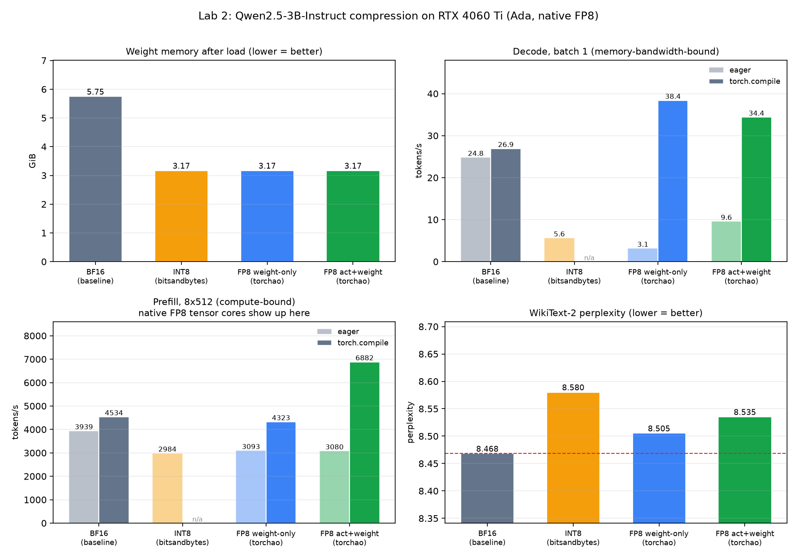
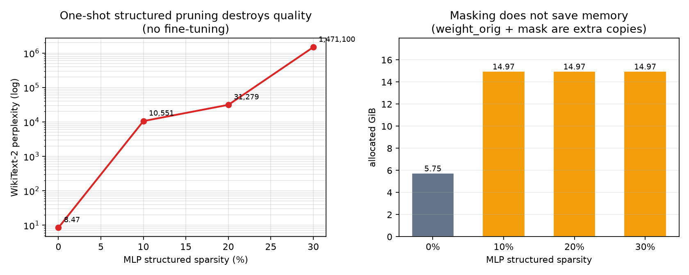

# Lab 02 — Quantization and Compression

**Status:** Measurements complete. Artifacts committed.
**Scope:** Bare HuggingFace + bitsandbytes + torchao on one Ada GPU. **Not**
vLLM. No distillation. Pruning is a no-finetune demonstration.

## Objective

On a GPU with native FP8 Tensor Cores, measure what INT8 and FP8 actually
change: allocated weight memory, eager versus compiled decode/prefill
throughput, and WikiText-2 perplexity. Separately show what one-shot
structured pruning does without recovery training.

## Methodology

Each configuration runs in its **own process** so
`torch.cuda.memory_allocated()` is not polluted by a previous model.

Reported weight memory is PyTorch allocated bytes after load/quantize
settles. `nvidia-smi` used-memory is also stored in the JSON (includes CUDA
context and the caching allocator) and is not the number in the tables.

- Decode: batch 1, 128 new tokens, best of 3 (memory-bandwidth-bound).
- Prefill: batch 8 × 512-token forward, best of 3 (compute-bound).
- PPL: WikiText-2 raw test, 24 non-overlapping 2048-token windows, 49,128
  predicted tokens, same eval code for every mode.
- Compile: `torch.compile` where the backend allows it. bitsandbytes
  `Linear8bitLt` does not compile cleanly; INT8 has eager-only speed.

FP8 weight-only uses torchao `Float8WeightOnlyConfig`. FP8 act+weight uses
`Float8DynamicActivationFloat8WeightConfig` (per-row, `torch._scaled_mm`).
`lm_head` / embeddings stay bf16 (`filter_fn` on the FP8 path; bitsandbytes
default).

Pruning: `torch.nn.utils.prune.ln_structured` (L2, `dim=0`) on 108 MLP
linears (`gate_proj` / `up_proj` / `down_proj`), no fine-tune.

## Experimental Setup

| Item | Value |
| --- | --- |
| GPU | RTX 4060 Ti 16GB, sm_89, native FP8 |
| Model | Qwen2.5-3B-Instruct, 3,085,938,688 parameters |
| Software | torch 2.13.0+cu130, transformers 5.15.0, bitsandbytes 0.50.0, torchao 0.18.0 |

T4/A10 (sm_75/sm_86) have no FP8 Tensor Cores. They can show memory
reduction; they will not reproduce the FP8 *speed* column.

## Findings

From `summary.json`:

| Config | Backend | Weight memory | vs BF16 | decode eager | decode compile | prefill eager | prefill compile | PPL | ΔPPL |
| --- | --- | ---: | ---: | ---: | ---: | ---: | ---: | ---: | ---: |
| BF16 | native | **5.748 GiB** | 1.00× | 24.80 | 26.90 | 3939 | 4534 | **8.4683** | — |
| INT8 | bitsandbytes LLM.int8() | **3.170 GiB** | **1.81×** | 5.61 | n/a | 2984 | n/a | 8.5803 | **+1.32%** |
| FP8 weight-only | torchao | 3.171 GiB | 1.81× | 3.14 | **38.39** | 3093 | 4323 | 8.5054 | +0.44% |
| FP8 act+weight | torchao per-row | 3.170 GiB | 1.81× | 9.57 | 34.37 | 3080 | **6882** | 8.5353 | +0.79% |



**Memory.** INT8 and both FP8 paths compress weights by **1.81×**, not 2×,
because embedding and `lm_head` remain bf16.

**Throughput is not the same as memory.** INT8 decode is **4.4× slower** than
eager BF16 (5.61 vs 24.80 tok/s). The kernel dequantizes to fp16 and does
not run on INT8 tensor cores. FP8 act+weight compiled prefill is **1.52×**
versus compiled BF16 (6882 / 4534) — that is the Tensor Core path. FP8
weight-only compiled prefill is 0.95× (still a bf16 matmul). Weight-only
compiled decode is the fastest decode (38.39 tok/s, 1.43×): batch-1 is
dominated by reading weights.

**Eager FP8 is slower than BF16.** Without inductor fusion, each layer pays
separate scale / cast / `_scaled_mm` / restore launches. FP8 weight-only
decode goes from 3.14 to 38.39 tok/s after compile. Any FP8 speedup claim
here is conditional on `torch.compile`.

**Quality.** A 1% PPL budget holds for both FP8 paths and not for INT8
(+1.32%). The measured values are reported as measured.

**Pruning (no recovery training)** from `results_prune.json`:

| MLP sparsity | model zeros | allocated GiB | decode tok/s | PPL |
| ---: | ---: | ---: | ---: | ---: |
| 0% | 0% | 5.748 | 24.97 | **8.4683** |
| 10% | 7.9% | 14.968 | 2.18 | **10,551** |
| 20% | 15.8% | 14.968 | 1.05 | **31,279** |
| 30% | 23.7% | 14.967 | 0.98 | **1,471,100** |



The mask API keeps `weight_orig` plus `weight_mask`, so allocated memory
rises ~2.6× and dense GEMMs still read zeros. Compression in this lab is
**entirely from quantization**. Distillation was not run.

## Trade-offs

| Lever | What it bought here |
| --- | --- |
| 8-bit weights (INT8 or FP8) | Weight capacity; decode bandwidth if the kernel is cheap |
| FP8 activations on sm_89 | Prefill / compute-bound matmul |
| bitsandbytes INT8 on this GPU | Memory only; decode slower |
| `torch.compile` | Required for torchao FP8 to win |
| `prune.ln_structured` without retrain | Quality collapse; no memory saving |

These tok/s numbers are **not** vLLM serving numbers. Do not multiply them
by Lab 1’s 31.9×. Lab 5 re-measures FP8 on that serving protocol.

## Limitations

- Single GPU, 3B model, WikiText-2 subset (not a chat eval).
- torchao tensors were never written to disk.
- `run_all.sh` does **not** regenerate every committed JSON. See
  Reproduction.
- No sparse-kernel prune, no recovery training, no distillation.

## Reproduction

`run_all.sh` runs, each in its own process:

1. eager speed+memory for `fp8-weight` and `int8` (`--skip-ppl`)
2. PPL for `bf16`, `int8`, `fp8-weight`, `fp8-dynamic`
3. compiled decode for `bf16`, `fp8-dynamic`, `fp8-weight`

Committed artifacts **not** produced by that script (run separately, same
`compress_bench.py`):

```bash
conda activate llmlab
cd lab2_compression

# Already covered by run_all.sh (partial matrix)
bash run_all.sh

# Additional invocations that match remaining JSON
python compress_bench.py --mode bf16 --skip-ppl
python compress_bench.py --mode fp8-dynamic --skip-ppl
python compress_bench.py --mode bf16 --compile --only prefill
python compress_bench.py --mode fp8-weight --compile --only prefill
python compress_bench.py --mode fp8-dynamic --compile --only prefill

python prune_demo.py
python summarize.py
```

Do not chain multiple modes in one Python process if you care about the
memory column.

## Artifacts

| File | Contents |
| --- | --- |
| `compress_bench.py` | One mode per process |
| `run_all.sh` | Partial matrix (see above) |
| `prune_demo.py` | Structured prune demo |
| `summarize.py` | `summary.json` + figures |
| `results_*.json` | Per-run raw measurements |
| `summary.json` | Merged table |
| `compression_summary.png` / `pruning_summary.png` | Figures |
