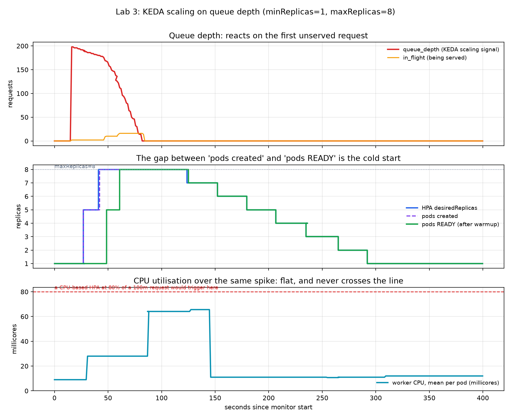

# Lab 03 — Queue-Depth Autoscaling Simulation

**Status:** Two local minikube runs recorded. Canonical evidence is `logs/`.
**Scope:** **Not real LLM GPU serving.** Workers are synthetic HTTP replicas
that sleep, burn a little CPU, and advertise a ready probe after a configured
startup delay. The question is which signal would scale that pool.

## Objective

Run a closed KEDA loop (1→8 replicas) on **queue depth**, and record CPU on
the same timeline. The CPU series is a counterfactual: would a standard
CPU HPA have moved?

## Architecture

```text
loadgen  →  broker (1 replica, owns the queue)
                ↑  /metrics  (KEDA metrics-api)
                ↓  lease / complete
         llm-worker  (KEDA 1→8)
```

The broker must be a single replica. If it were load-balanced, each scrape
would see a shard of the queue.

`deployment.yaml` does **not** set `spec.replicas` on `llm-worker`. That
field is owned by the autoscaler.

This layout is *shaped like* a waiting queue in front of a bounded worker
pool. It is not vLLM, and it does not load Qwen.

## Methodology

Simulated LLM traits (environment on the worker container):

| Parameter | Value | Stands in for |
| --- | --- | --- |
| `STARTUP_DELAY_S` | 20 | Weight load; readiness stays false until it finishes |
| `WORKER_CONCURRENCY` | 2 | Per-replica batch slots; overflow is queue depth, not CPU% |
| `CPU_BURN_RATIO` | 0.05 | Host CPU mostly idle while “decode” waits |

Load: `loadgen.py` admits **200** requests in one burst, each with
**3000 ms** of simulated work.

KEDA `ScaledObject` (`scaledobject.yaml`):

- trigger: `metrics-api` → broker `/metrics` field `queue_depth`
- `targetValue: 5` → `desiredReplicas = ceil(queue_depth / 5)`, capped at 8
- `minReplicaCount: 1`, `maxReplicaCount: 8`
- scaleUp: stabilization 0 s, +4 pods / 15 s
- scaleDown: stabilization 60 s, −1 pod / 30 s

metrics-server is installed **only to observe CPU**. Nothing scales on it.

With `minReplicaCount: 1`, KEDA warns that `pollingInterval` and
`cooldownPeriod` do not apply; HPA `behavior` owns the cadence. Those fields
remain in the YAML, commented, as the scale-to-zero case (not measured).

## Experimental Setup

minikube v1.38.1, Kubernetes v1.35.1, docker driver (6 vCPU, 6 GB), KEDA
(Helm, kedacore), metrics-server v0.8.1.

## Findings

Canonical timeline (`logs/timeline.csv`, `hpa_scaling_timeline.png`):



| Event | t |
| --- | --- |
| Idle: 1 replica, queue=0, CPU 9 m | 0 s |
| Burst, queue_depth=198 | 16.1 s |
| HPA desired 1→5; pods created | 27.0 s |
| 8 pods created | 42.1 s |
| 5 Ready | 48.5 s |
| 8 Ready | 60.9 s |
| 200 requests complete | 84.3 s |
| Per-pod CPU peak **65.6 m** | 127.4 s |
| Back to 1 replica | 292.0 s |

HPA `TARGETS` in `logs/hpa-watch.log` is queue_depth versus 5. queue=198
implies ceil(198/5)=40, clipped to `maxReplicaCount: 8`.

From the same CSV: longest queued wait **65.6 s**, mean queue wait
**46.2 s**, peak in-flight **16** (8 × concurrency 2).

`logs/cold-start.log` (from `pods-lifecycle.jsonl`; scale-down deletes
pods, so this has to be recorded live):

- 7 autoscaler-added pods: created→Ready **20 s / 20.0 s / 20 s**
- Decision to object creation is ~1 s; useful capacity waits the full
  startup delay
- Image was already cached. A real GPU replica would also pay image pull
  and weight download; that was not measured

HPA desired drops below 8 at t=123.6 s and reaches 1 at t=292.0 s
(~168 s), consistent with a 60 s down window and −1 pod / 30 s.

### Why CPU is a poor signal *in this simulation*

Worker request is 100 m CPU. An 80% CPU HPA line is **80 m**. Observed
per-pod peak is **65.6 m** (8-pod total 513 m) and occurs **43 s after**
the queue is empty. A CPU HPA at that threshold would have stayed at 1
replica through a 200-request backlog, then seen its highest reading
during scale-in.

That is the intended synthetic behavior: `CPU_BURN_RATIO=0.05` plus a
hard concurrency cap. It is consistent with Lab 1’s device-side finding
that a memory-bound decode kernel can look “busy” on SM% while the host
CPU stays quiet — but Lab 3 does **not** measure a GPU.

Queue depth becomes nonzero on the first unserved request (t=16.1 s).
Desired replicas move at t=27.0 s while the CPU series is still 9 m.

A second run (`logs_run1/timeline.csv`) peaked at **63.1 m** per pod, also
under 80 m. `logs_run1/cold-start.log` only records the initial replica
(23 s). Do not treat run 1 as a complete cold-start series.

## Trade-offs

Scale-up is aggressive because queued requests already accrue delay and a
new replica still waits `STARTUP_DELAY_S`. Scale-down is conservative
because a mistaken scale-in repeats that delay. This is a configuration
choice for this demo, not a cluster-wide recommendation.

## Limitations

- **No GPU model, no vLLM, no real tokens.**
- Startup is a timer, not CUDA init or weight I/O.
- One minikube node, 6 vCPU / 6 GB.
- Results are not a general claim about Kubernetes, KEDA, or production
  HPA policy.
- Scale-to-zero was not run.

## Reproduction

```bash
# Prerequisites: docker, minikube, kubectl, helm on PATH
./setup_cluster.sh
TOTAL=200 WORK_MS=3000 MONITOR_S=400 ./run_load_demo.sh
```

`smoke_local.sh` exercises broker + worker without Kubernetes.

## Artifacts

| File | Contents |
| --- | --- |
| `deployment.yaml` / `scaledobject.yaml` | Broker, worker, KEDA |
| `app/broker.py` / `app/worker.py` / `app/Dockerfile` | Simulated stack |
| `setup_cluster.sh` / `run_load_demo.sh` / `smoke_local.sh` | Ops |
| `loadgen.py` / `monitor.py` / `record_pods.py` | Burst + 1 Hz CSV + pod lifecycle |
| `analyze_cold_start.py` / `plot_timeline.py` | Summaries |
| `logs/timeline.csv` | Canonical 1 Hz series |
| `logs/hpa-watch.log` / `logs/cold-start.log` / `logs/pods-lifecycle.jsonl` | Supporting logs |
| `hpa_scaling_timeline.png` | Figure |
| `logs_run1/timeline.csv`, `hpa_scaling_timeline_run1.png` | Repeat CPU series (cold-start log incomplete) |
