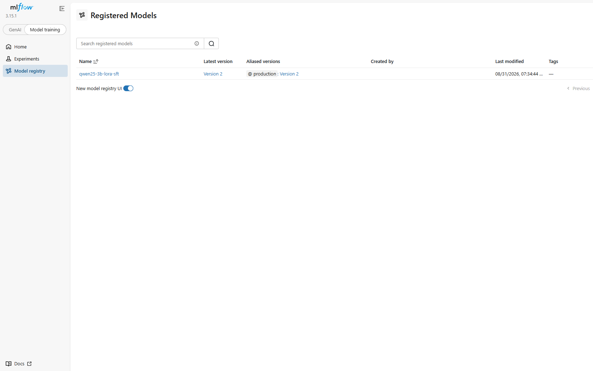
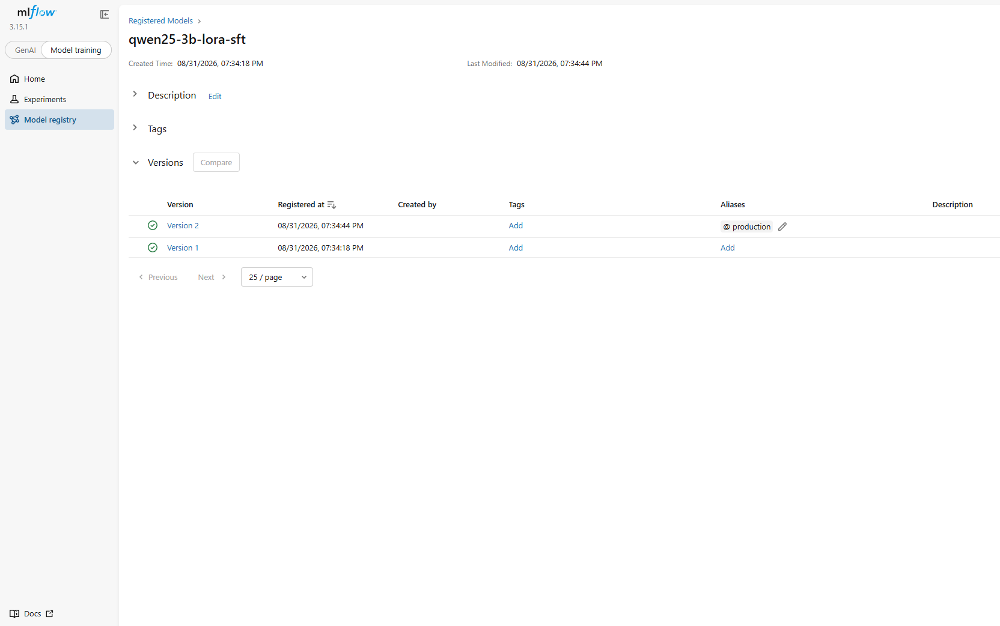
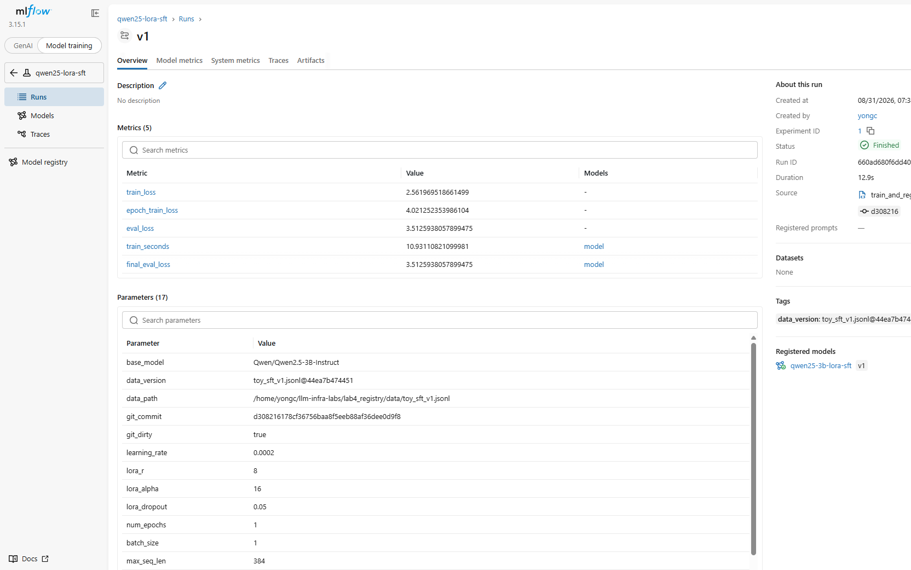
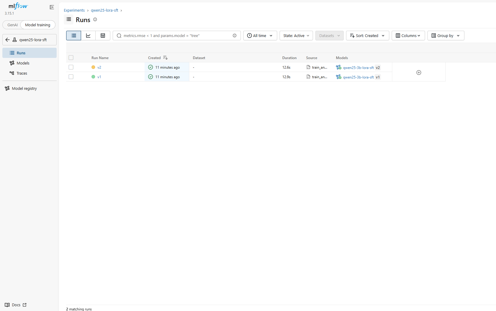
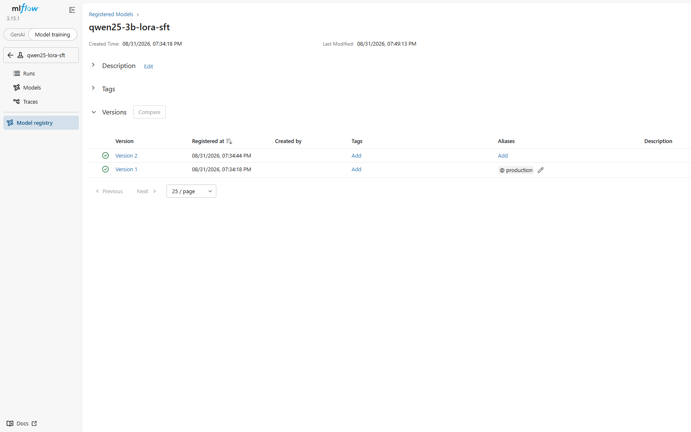
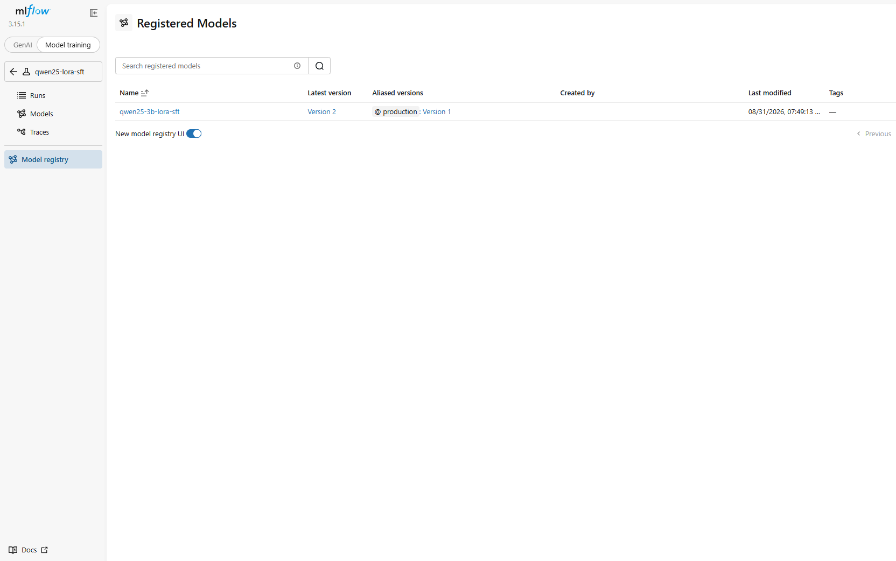

# Lab 04 — Model Registry, Lineage, and Rollback

**Status:** Two toy LoRA versions registered locally; UI screenshots committed.
**Scope:** MLflow Model Registry semantics on a 1-epoch adapter. **Not** SOTA
training, **not** a production registry, and **not** wired to the Lab 1/5
serving stack.

## Objective

Produce two real LoRA adapters that differ only by hyperparameters, log
enough lineage to tell them apart later, point Production at v2, then point
it back at v1. The experiment is the metadata and the pointer, not model
quality.

## Methodology

`train_and_register.py` runs one epoch of LoRA SFT on
`Qwen/Qwen2.5-3B-Instruct` with 32 local JSONL rows (24 train / 8 eval),
logs params/metrics, and `register_model`s the adapter.

Each run records:

- `data_version`: filename + sha256 prefix of `data/toy_sft_v1.jsonl`
- `git_commit` / `git_dirty` from the repo at train time
- hyperparameters (`learning_rate`, `lora_r`, …)
- `eval_loss` / `final_eval_loss`

Rollback uses `transition_model_version_stage(..., stage="Production",
archive_existing_versions=True)` and also
`set_registered_model_alias("production", version)` so MLflow 3 UI aliases
match the deprecated stage API.

Serving is out of scope. A real worker would still have to load the adapter
onto the 3B base (a cold start; see Lab 3). This lab only moves the
registry pointer.

## Experimental Setup

RTX 4060 Ti 16GB, torch 2.13.0+cu130, transformers 5.15.0, peft 0.20.0,
MLflow 3.15.1. Tracking URI defaults to `sqlite:///tracking.db` (gitignored).

## Findings

v1 and v2 share data file and git commit. They differ by lr and rank. v2
has worse eval loss and was still promoted, then archived.

| | v1 (Production after rollback) | v2 (Archived) |
| --- | --- | --- |
| run | `660ad680f6dd402a84a98ad5b71b9f2c` | `c97559859ce541b685414628fc591d55` |
| `data_version` | `toy_sft_v1.jsonl@44ea7b474451` | same |
| `git_commit` | `d308216178cf36756baa8f5eeb88af36dee0d9f8` | same |
| `git_dirty` | true | true |
| `learning_rate` | **2e-4** | **1e-4** |
| `lora_r` | **8** | **16** |
| `final_eval_loss` | **3.5126** | **3.8399** |
| train wall time | 12.9 s | 12.6 s |

`git_commit` is the then-current HEAD of this working tree (`d308216`),
which did not yet contain `train_and_register.py` (`git_dirty=true`). That
is part of the lineage lesson: a hash of a dirty tree does not identify the
script that ran. It is **not** a commit of the future public repository.

Without `log_param` / `log_metric`, two adapter directories would show rank
in `adapter_config.json` and would not show learning rate or eval loss.
The registry then stores files, not comparable training decisions.

### Screenshots

Registered model before rollback (`@production` → Version 2):



Version list before:



v1 run parameters and metrics:



Experiment runs:



After rollback (`@production` → Version 1):





The stage/alias flip is a metadata write. `rollback_result.txt` is stdout
from a later local `python train_and_register.py rollback --to-version 1`
on the existing sqlite DB, when v1 was **already** Production:

```
rollback_seconds=0.0368
```

That is the `transition_model_version_stage` wall time for this re-run
(0.0368 s), plus a status dump. It is not a serving-side adapter load, and
it is not a saved trace of the original v2→v1 flip shown in the screenshots.

## Trade-offs

MLflow 2.9+ deprecates stages in favor of aliases. This experiment calls
both so the UI and the stage API describe the same Production pointer.

Serving code *should* depend on `models:/qwen25-3b-lora-sft/Production` (or
`@production`) if it were integrated. It is not integrated in this
repository.

## Limitations

- 32 synthetic instruction rows; one epoch; eval loss only.
- Adapters and `tracking.db` are gitignored; screenshots are the committed
  UI evidence.
- Screenshot 03 was captured from a local MLflow UI and may show a host
  path inside a parameter value. It is not required to read those path
  strings to see lr, rank, data hash, and eval loss.
- No serving-side load of the rolled-back adapter.

## Reproduction

```bash
conda activate llmlab
# peft and mlflow as in Experimental Setup

cd lab4_registry
./run_demo.sh
python train_and_register.py rollback --to-version 1
python train_and_register.py status

mlflow ui --backend-store-uri sqlite:///tracking.db --host 127.0.0.1 --port 5000
```

`run_demo.sh` trains v1, trains v2, and promotes v2. Rollback is a separate
command so it can be timed or screenshotted on its own.

## Artifacts

| File | Contents |
| --- | --- |
| `train_and_register.py` | Train, register, promote, rollback, status |
| `data/toy_sft_v1.jsonl` | 32-row local dataset |
| `run_demo.sh` | v1 + v2 + promote |
| `screenshots/` | UI before/after and run lineage |
| `rollback_result.txt` | Later stage-API re-run stdout (`rollback_seconds=0.0368`) |
| `tracking.db`, `mlartifacts/`, `outputs/` | Local only (gitignored) |
