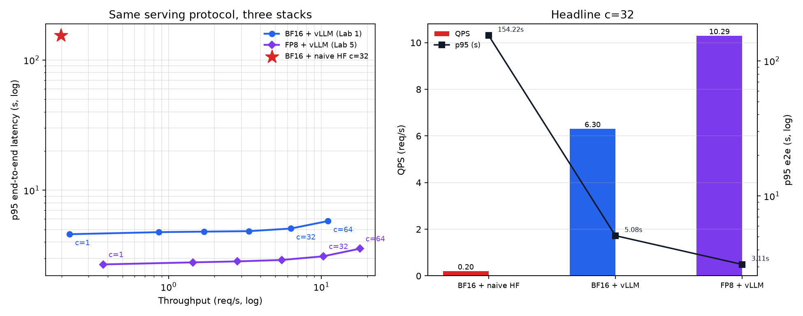

# Lab 05 — FP8 Integration with vLLM

**Status:** Measurements complete on the Lab 1 vLLM protocol.
**Scope:** vLLM online `--quantization fp8` only. Not a reload of Lab 2
torchao tensors. KV cache dtype left at default (not FP8).

Lab 5 was added after Labs 1–4, which is why the directory is numbered 5.
Read it after Lab 2: it is the first time compression and serving share a
protocol.

## Objective

Lab 1’s serving numbers are **BF16 + vLLM**. Lab 2’s FP8 numbers are
**bare HuggingFace / torchao**. Those stacks never met. This lab loads the
same HF checkpoint into the same vLLM engine settings as Lab 1, enables
online FP8, and repeats the concurrency sweep.

## Methodology

Protocol copied from Lab 1:

- same 8 prompts, cycled, Qwen2.5 chat template
- 128 forced tokens (`min_tokens=128`, `ignore_eos=True`)
- `enable_prefix_caching=False`
- `dtype=bfloat16`, `max_model_len=2048`, `gpu_memory_utilization=0.85`,
  `max_num_seqs=128`
- p95 = e2e including queue wait
- `asyncio.Semaphore(N)`; headline is 32 requests at concurrency 32
- one warmup request

Quantization is vLLM 0.10.2 online FP8: E4M3 W8A8, dynamic activation scales,
per-tensor CUTLASS on sm_89 (not the Marlin fallback). Lab 2’s fp8-dynamic
path was torchao per-row and never checkpointed. Lab 2 PPL is **not**
claimed for these serving weights.

`kv_cache_dtype=fp8` is off so the 1.63× is not mixed with a second lever.

## Experimental Setup

| Item | Lab 2 fp8-dynamic | This lab |
| --- | --- | --- |
| Checkpoint | `Qwen/Qwen2.5-3B-Instruct` BF16 | same |
| GPU | RTX 4060 Ti, sm_89 | same |
| Format | FP8 E4M3 act+weight | FP8 E4M3 W8A8 |
| Quantizer | torchao per-row | vLLM online, per-tensor |
| Serving | HF `generate()` | vLLM `AsyncLLMEngine` |
| KV dtype | n/a | auto (not fp8) |
| Env | `llmlab` | `vllmlab` (vLLM 0.10.2) |

## Findings

Headline from `comparison.json` (c=32):

| Stack | p95 e2e | QPS | tok/s | vs naive | vs BF16+vLLM |
| --- | ---: | ---: | ---: | ---: | ---: |
| BF16 + naive HF (Lab 1) | 154.22 s | 0.197 | 25.3 | 1.00× | — |
| BF16 + vLLM (Lab 1) | 5.08 s | 6.302 | 806.7 | 31.9× | 1.00× |
| FP8 + vLLM (this lab) | **3.11 s** | **10.289** | **1317** | **52.1×** | **1.63×** |



52.1× is **measured** on these three artifacts. It is not 31.9× times a
Lab 2 decode factor.

Concurrency sweep (`fp8_vllm_results.json` vs Lab 1 `vllm_results.json`):

| c | BF16 p95 | FP8 p95 | BF16 QPS | FP8 QPS | FP8 / BF16 |
| ---: | ---: | ---: | ---: | ---: | ---: |
| 1 | 4.593 s | 2.693 s | 0.225 | 0.373 | **1.66×** |
| 4 | 4.764 s | 2.792 s | 0.866 | 1.441 | **1.66×** |
| 8 | 4.808 s | 2.842 s | 1.706 | 2.828 | **1.66×** |
| 16 | 4.848 s | 2.913 s | 3.353 | 5.500 | **1.64×** |
| 32 | 5.076 s | 3.109 s | 6.302 | 10.289 | **1.63×** |
| 64 | 5.794 s | 3.561 s | 11.021 | 17.915 | **1.63×** |

The ratio does not collapse through c=64. That matches Lab 1: TPOT +6.8%
and decode mem-controller ~93% at low concurrency — this 3B is still
bandwidth-bound on this card, so fewer weight bytes still buy decode
speed. 1.63× is below 2× (unquantized embedding / `lm_head`, KV reads,
attention, per-tensor dequant).

### KV cache notes (provenance)

vLLM init lines captured in `fp8_vllm_results.json` → `engine_log_lines`:

- weight **3.21 GiB**
- available KV **9.60 GiB**, **279,664** tokens
- max concurrency at 2048 tokens/request: **136.55×**

The same JSON has a `kv_cache` object that also stores
`lab1_bf16_kv_gib: 7.08` and `lab1_bf16_kv_tokens: 206272`. Those Lab 1
values are **not** in `lab1_serving/vllm_results.json`, and the current
`fp8_vllm_bench.py` does not write the `kv_cache` block. Treat 7.08 GiB /
206,272 as a transcribed init-log comparison, not a first-class Lab 1
artifact. Headline concurrency is 32; the 1.63× is faster decode of the
same 32 sequences, not a higher in-flight count.

## Trade-offs

Online per-tensor FP8 is the serving-stack counterpart of Lab 2’s in-process
per-row FP8, not the same tensors. Leaving KV in the default dtype keeps the
weight-quantization lever isolated. Enabling `kv_cache_dtype=fp8` would
raise KV capacity and confound this comparison.

## Limitations

- One GPU, one 3B model, same short-prompt protocol as Lab 1.
- No PPL on the vLLM FP8 weights.
- Engine subprocess may hang on shutdown; the script `os._exit(0)` after
  writing JSON and the figure.
- Do not productize this as “FP8 serving in production.” It is one
  same-protocol remasurement.

## Reproduction

```bash
conda activate vllmlab
python lab5_integration/fp8_vllm_bench.py
python lab5_integration/fp8_vllm_bench.py --plot-only
```

`--headline-only` runs c=32 only. GPU must be free of another engine.

## Artifacts

| File | Contents |
| --- | --- |
| `fp8_vllm_bench.py` | Lab 1 protocol + `quantization="fp8"` |
| `fp8_vllm_results.json` | Sweep, engine log lines, comparison blob |
| `comparison.json` | Three-column c=32 table |
| `fp8_vs_bf16_serving.png` | Figure |
